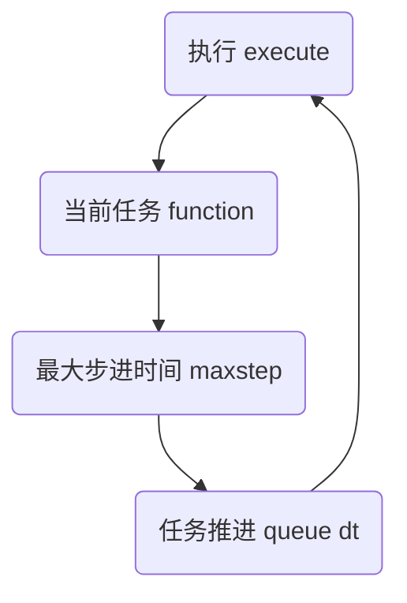
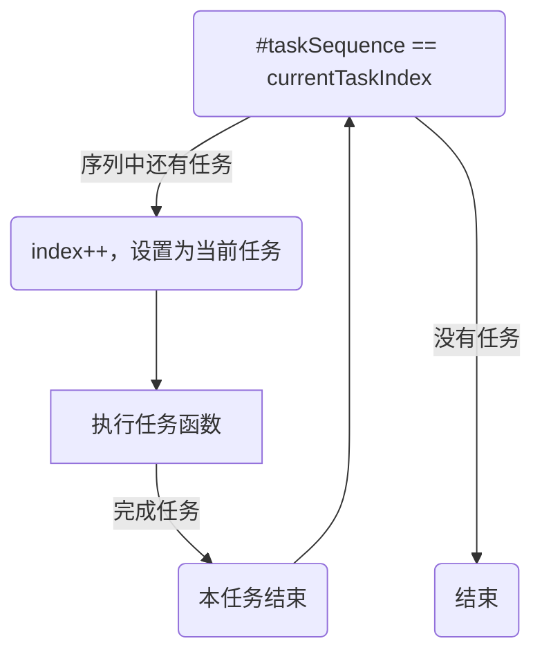
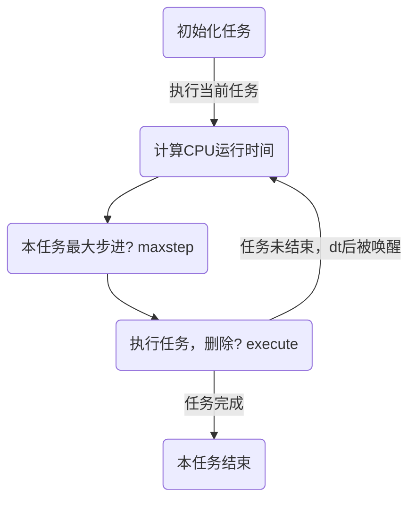

# Agent模板

## 任务

### 任务类型
1. 起止时间可计算：不使用maxstep推进，直接在起止时间设置刷新。其他刷新时间根据cpu运算时间确定。
2. 起止时间不可计算：使用maxstep推进。可以在一定条件设置假死状态。要注意唤醒。

### 任务执行
`agent:execute()`执行任务



### 任务推进
任务相关变量
- 任务推进相关
  - currentTask: 当前执行的任务（相当于包了一层）
  - taskSequence: 任务序列
  - currentTaskIndex: 当前执行的任务索引
- 任务种类相关
  - tasks: 任务种类列表。自行添加能够实现各种功能的任务。

```lua
-- 任务推进变量之间的关系
agent.currentTask = agent.taskSequence[agent.currentTaskIndex]
```

tasks表结构
- tasks
  - 任务名()
    - maxstep(): 可选。限制最大步进时间的函数。如果没有则不限制，直接使用CPU运行时间得到的dt。
  - ...


#### 自推进
Agent 按照任务序列推进。时间推进交给任务。



任务执行函数:


### 各种任务推进方法实现的讨论
1. 当前选择的是从任务序列中单次逐个执行任务函数。这样的坏处是每个任务都需要实现自己的时间推进，没有统一管理；好处是各个任务实现时间推进的方式比较自由，可以考虑任务的特性来实现。（如有的任务是已知的就不需要用到maxstep()，直接在起止时间设置刷新，其他按照空余时间刷新即可。）
2. 另一种方法是在Agent层面统一管理时间推进，任务结构大致分为`execute()`，`maxstep()`两个函数。
    - 坏处是在尝试的时候发现难以初始化，或者会重复初始化。而且这些函数没有办法访问初始化定义的变量（无法访问上下文），只能通过参数传递。这样就和没有改动之前一样了。
    - 好处是在Agent层面统一管理时间推进，不需要在每个任务中实现时间推进。
3. 没有改进之前在整个系统层面实现时间推进。
    - 坏处和2一样，需要通过任务传递参数。且会在所有时间片对所有组件进行刷新。当运动的组件多了以后会降低运行速度。
    - 好处是可以统一管理时间推进，不需要在每个组件中实现时间推进。

#### 假死状态
可能有时候需要用到假死状态。即某些任务推进时间很小，但是又不想让它推进，这时候可以设置一个假死状态，让它不推进。等待某个组件的某个状态改变后通知他重新激活再推进。

### 删除任务
问题：使用索引推进还是做完删掉？
> 不过就算用索引推进其实也不难管理。`table.insert(table, pos, value)`中的pos是table的索引位置。
