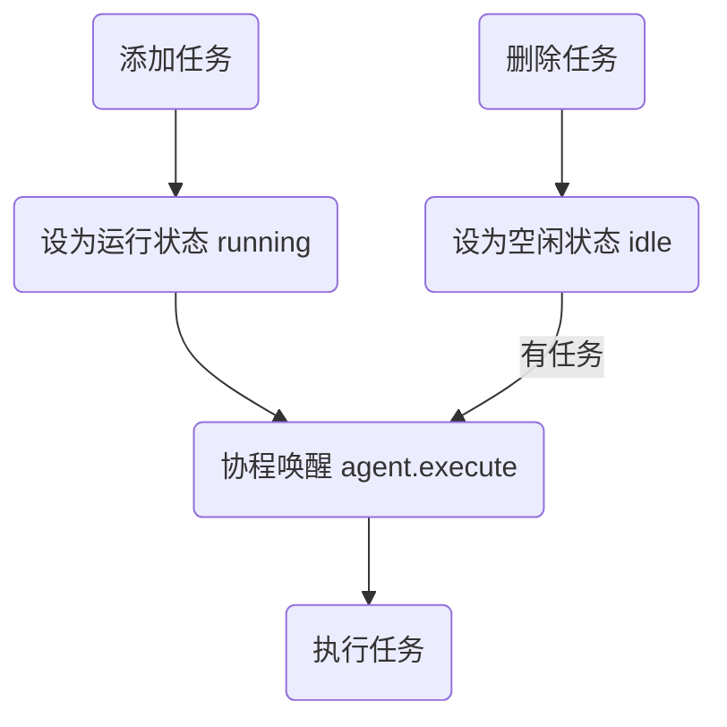
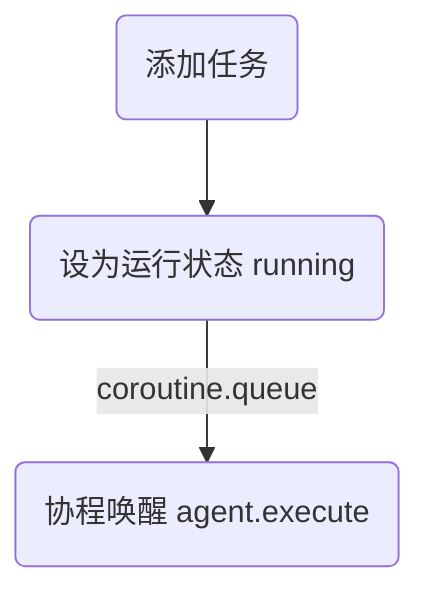
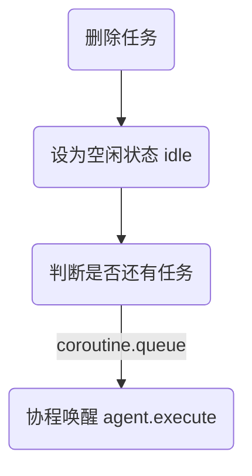
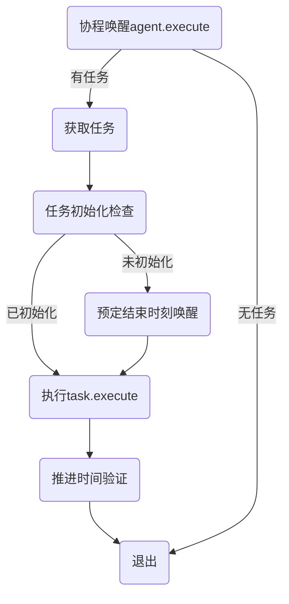

# Agent模板

## 任务
总流程


### 添加任务


### 删除任务


### 任务执行
`agent:execute()`执行任务



### 任务推进
任务相关变量
- 任务推进相关
  - agent.tasks: 任务列表
  - agent.tasksequence: 任务队列
  - agent.lasttime: 上次执行时间

```lua
-- 任务推进变量之间的关系
agent.currentTask = agent.taskSequence[agent.currentTaskIndex]
```

tasks表结构
- tasks
  - 任务名
    - `init()`: 限制最大步进时间的函数。如果没有则不限制，直接使用CPU运行时间得到的dt。
    - `execute()`: 执行任务的函数。
  - ...

# 交互
Agent之间通过任务相互等待进行交互。

属性
`agent.occpuier`：占用者，显示当前agent被谁占用。如果没有被占用则为nil。