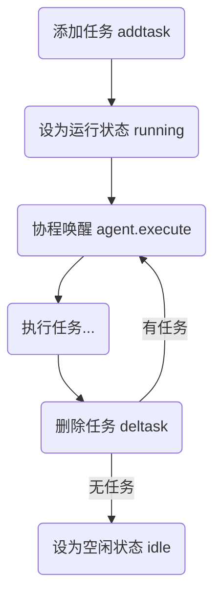
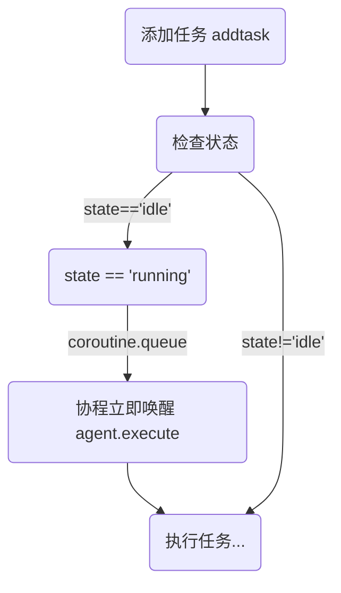
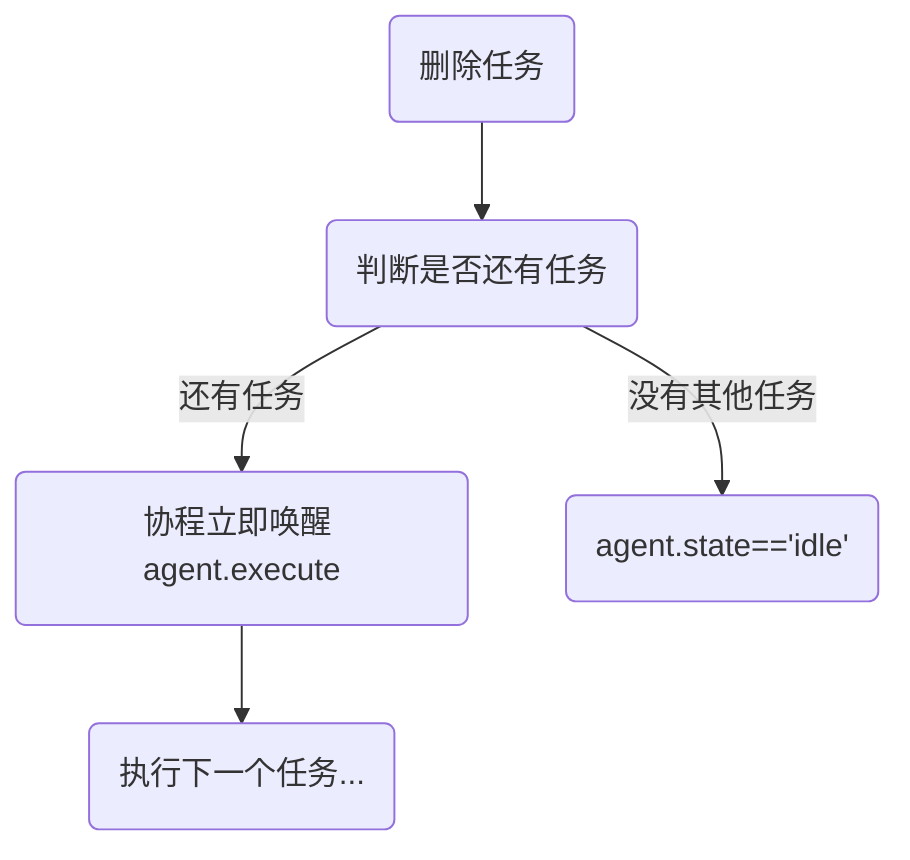
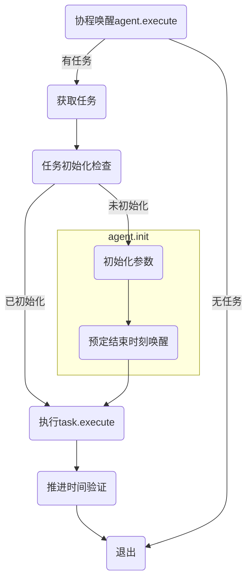

# Agent 模板

## 任务

Agent 自刷新总流程

### 添加任务

### 删除任务

### 任务执行

`agent:execute()`执行任务

### 任务相关变量

- `parms.init`: 是否完成任务初始化。决定是否执行`task.init`函数。
- `params.dt`：执行任务所需时间。init 后应该使用`coroutine.queue`在`params.dt`后唤醒 agent.execute，完成任务并删除。

### 任务推进

任务相关变量

- 任务推进相关
  - agent.tasks: 任务列表
  - agent.tasksequence: 任务队列
  - agent.taskstart: 任务开始时间

tasks 表结构

- tasks
  - 任务名
    - `init()`: 限制最大步进时间的函数。如果没有则不限制，直接使用 CPU 运行时间得到的 dt。
    - `execute()`: 执行任务的函数。
  - ...

# 属性

agent.state: 状态，有`idle`和`running`两种状态。用于检测 agent 是否正在执行任务。

# 交互

Agent 之间通过任务相互等待进行交互。

属性
`agent.operator`：操作者，显示当前 agent 被谁占用。如果没有被占用则为 nil。
