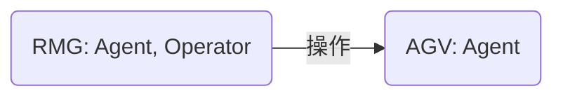
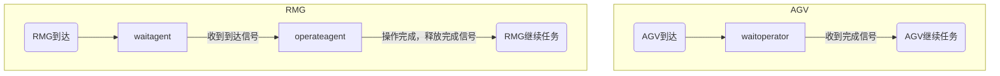
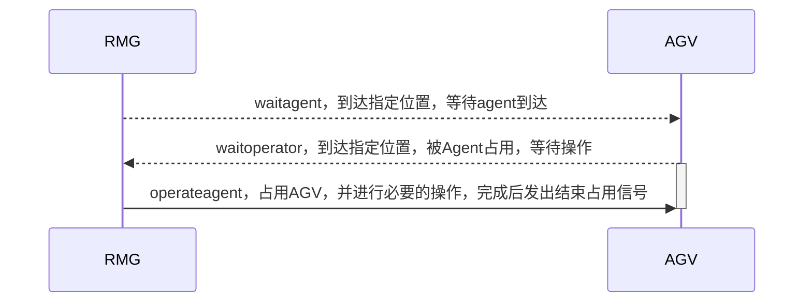

# Agent模板

## 任务

### 任务类型
1. 起止时间可计算：不使用maxstep推进，直接在起止时间设置刷新。其他刷新时间根据cpu运算时间确定。
2. 起止时间不可计算：使用maxstep推进。可以在一定条件设置假死状态。要注意唤醒。

### 任务执行
`agent:executeTask()`执行任务


### 任务推进
任务相关变量
- 任务推进相关
  - currentTask: 当前执行的任务（相当于包了一层）
  - taskSequence: 任务序列
  - currentTaskIndex: 当前执行的任务索引

```lua
-- 任务推进变量之间的关系
agent.currentTask = agent.taskSequence[agent.currentTaskIndex]
```

tasks表结构
- tasks
  - 任务名
    - `execute()`: 执行任务的函数。
    - `maxstep()`: 限制最大步进时间的函数。如果没有则不限制，直接使用CPU运行时间得到的dt。
  - ...

`execute()` 和 `maxstep()` 从代码层面都允许不提供，但是至少实现一个，否则没有这个任务的实现。

> `maxstep()` 函数中返回负数（一般设置为-1）时，会重新对当前时间片的 `maxstep()` 重新进行计算。一般用于maxstep中删除了任务导致依赖关系混乱的情况，非必要不推荐这样使用。

### 各种任务推进方法实现的讨论
1. 从任务序列中单次逐个执行任务函数。这样的坏处是每个任务都需要实现自己的时间推进，没有统一管理；好处是各个任务实现时间推进的方式比较自由，可以考虑任务的特性来实现。（如有的任务是已知的就不需要用到maxstep()，直接在起止时间设置刷新，其他按照空余时间刷新即可。）
2. 另一种方法是在Agent层面统一管理时间推进，任务结构大致分为`execute()`，`maxstep()`两个函数。
    - 坏处是在尝试的时候发现难以初始化，或者会重复初始化。而且这些函数没有办法访问初始化定义的变量（无法访问上下文），只能通过参数传递。这样就和没有改动之前一样了。
    - 好处是在Agent层面统一管理时间推进，不需要在每个任务中实现时间推进。
3. 当前选的时没有改进之前在整个系统层面实现时间推进。（因为试了上面两种方法都不好用）
    - 坏处和2一样，需要通过任务传递参数。且会在所有时间片对所有组件进行刷新。当运动的组件多了以后会降低运行速度。
    - 好处是可以统一管理时间推进，不需要在每个组件中实现时间推进。老师给的示例中也是这样实现的。

#### 假死状态
可能有时候需要用到假死状态。即某些任务推进时间很小，但是又不想让它推进，这时候可以设置一个假死状态，让它不推进。等待某个组件的某个状态改变后通知他重新激活再推进。

### 删除任务
todo: 从任务删除改为索引推进，能够保留历史执行的任务。
> 使用索引推进其实也不难管理。`table.insert(table, pos, value)`中的pos是table的索引位置。感觉存储的内容也不会太占用资源，所以可行。还可以在必要的时候导出分析。

# 交互
Agent之间通过任务相互等待进行交互。

属性
`agent.occpuier`：占用者，显示当前agent被谁占用。如果没有被占用则为nil。

## 通过maxstep通知agent
`agent:maxstep()` 的返回值反映了agent当前任务最大能够推进的时间，但是也可以通过返回特定的值来实现特定的功能。

需要注意的是，如果需要在maxstep中返回以下值实现一些特殊的操作，那么最好保证有清晰的退出思路。否则可能会导致死循环，仿真无法推进。
- `return 0`：**表示最大推进时间为0**，即不推进时间。这种操作通常用于设置状态类型的任务。下一次计算maxstep仍为当前时间（会周转）。
- `return -1`：**表示需要重新执行当前时间片的maxstep**。与`return 0`的区别是：`return -1`后会立刻打断当前时间片maxstep的执行，重新从头开始计算（不周转）；`return 0`则是在当前时间片的计算结束后重新计算（周转），计算的步骤更多。这种操作通常用于改变了agent状态后，通过立即重新执行当前时间片的maxstep使关注相关状态变化的agent能够检测到变化，进行下一步的操作。
- `return agent:maxstep()`：表示最大推进时间为当前agent下一个任务的最大推进时间。这种操作**通常用于不影响其他agent**，但是需要改变agent状态/立即删除当前任务执行下一个任务的情况。

## 示例
此处以AGV和RMG的交互为例。



AGV
- `waitoperator`: 等待另一个agent对agv的占用和操作。将操作的agent视为operator

RMG
- `waitagent`: 等待被操作的agent就绪
- `operateagent`: 占用、操作agent

AGV和RMG各自的流程：


AGV与RMG的通信流程，以RMG先到达目标位置等待为例：
