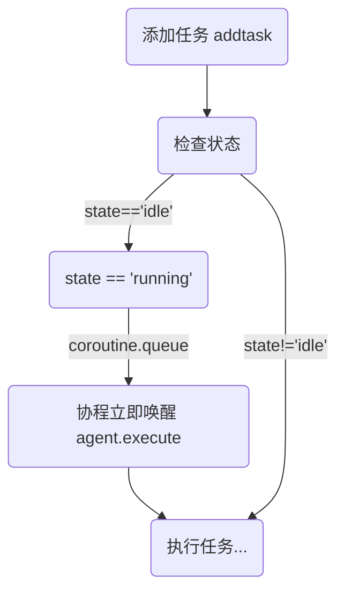
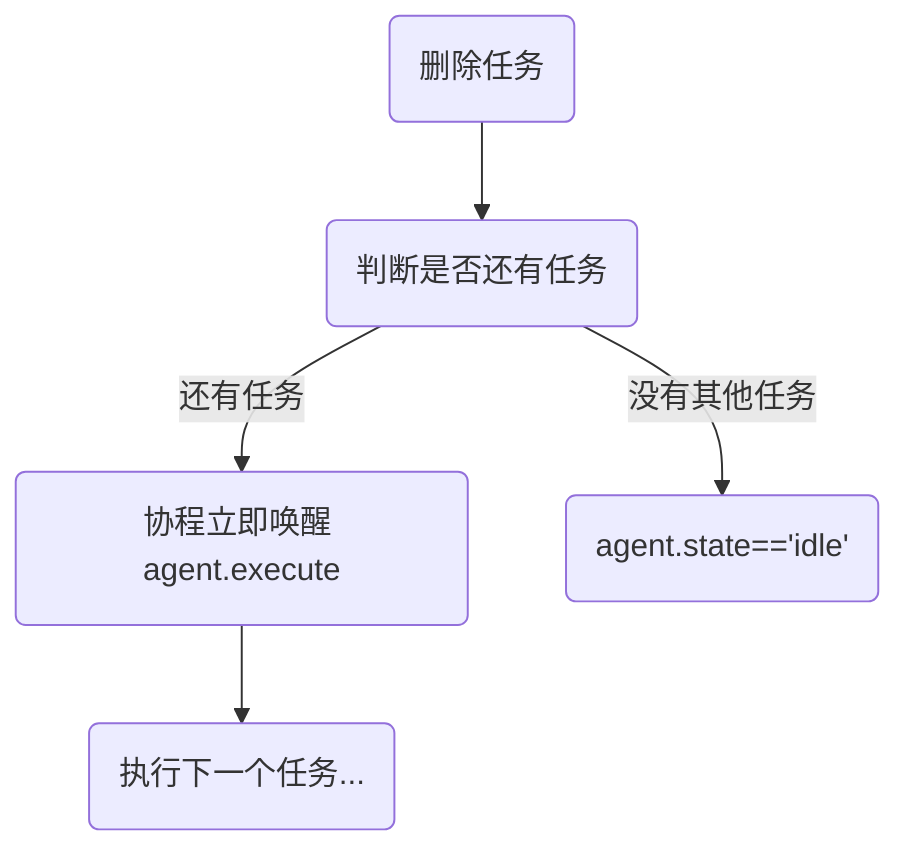
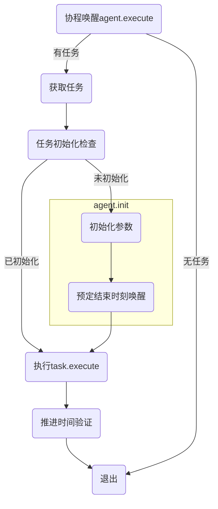
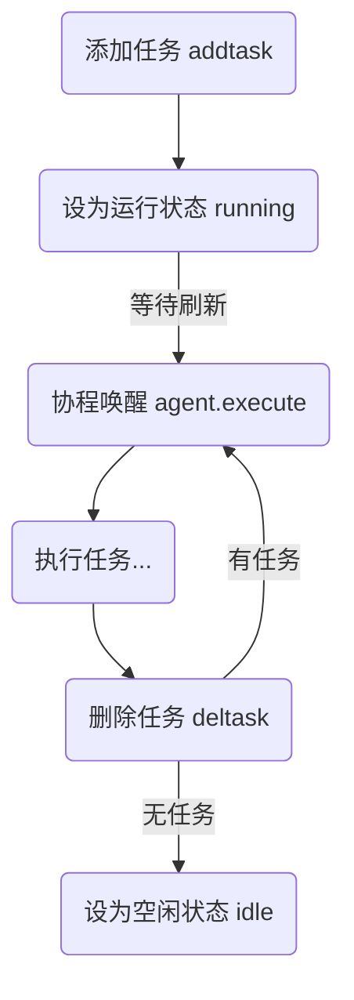

# Agent

Agent 定义了一个智能体的工作流程和基本属性，支持智能体的行为控制和任务执行。Agent 作为基类主要起到模板作用，方便用户添加其他类型的智能体。

```lua
local agent = Agent()
```

## 属性

agent 中定义的属性并非所有智能体都会用到（如 `speed` 和 `model`），用户可以根据自己的需求进行扩展。

- `speed = {1, 1, 1}` 定义智能体在 x,y,z 三个方向的速度，默认为`{1, 1, 1}`
- `model = nil` 智能体的三维模型，用于可视化，默认为`nil`
- `pos = {0, 0, 0}` 智能体的位置，默认为`{0, 0, 0}`。只有在任务的 `init()` 部分才进行更新
- `taskstart = nil` 智能体任务开始时间标记，默认为`nil`。由管理任务的相关函数设置。
- `tasks = {}` 记录了智能体支持的任务。
- `tasksequence = {}` 智能体的任务队列，默认为空。由用户通过函数添加任务。
- `state` 标记智能体的状态，如空闲 idle、工作中 running 等。
- `type = "agent"` 智能体的类型，为 agent。当其他类型的智能体继承 agent 时，可以通过修改 type 来区分不同的智能体。
- `id` agent 一般不设置 id，即默认值为 `nil`，由子类定义。
- `timeError` 任务允许的计算时间误差范围，默认为 10e-8，用于判断任务完成情况。
- `lastpos` 智能体执行任务的锚点位置，表示智能体“上次的位置”。可以是任务开始时的位置，也可以是上一次任务 execute 后的位置，取决于任务类型。主要用于结合 dt 计算智能体的当前位置。

## 函数

Agent 中的函数主要是管理智能体任务和状态的函数。

### 原生函数

原生函数是指 Microcity 三维模型中直接可用的函数。这里只列出了其中的一部分。

由于 Agent 已经将三维模型存储在 model 变量中，因此对 agent 直接调用 agent:setpos() 和 agent:delete() 等函数不会起作用。假设 agent.model 中存储了一个三维模型，则需要调用 agent.model:setpos() 和 agent.model:delete() 才能达到预期的效果。

考虑到 Agent 作为基类，子类模型可能更加复杂（例如，可能存在多个部分，此时 agent.model 可能为一个列表）。在这种情况下，如果想要直接对 agent 调用这些函数（例如 agent:setpos() 和 agent:delete()），需要在子类中根据具体的结构重写这些函数。

#### setpos

设置智能体三维模型的位置。

```lua
agent:setpos(x, y, z)
```

#### delete

删除智能体的模型

```lua
agent:delete()
```

### 任务相关函数

#### addtask

将任务添加到任务队列。成功添加后将智能体的状态设为 running。

```lua
agent:addtask(name, params)
```

添加任务流程



#### deltask

删除任务队列中的首个任务。
成功删除后根据任务队列是否为空，将智能体的状态设为 idle 或 running。

```lua
agent:deltask()
```

删除任务流程



#### execute

执行智能体的当前任务（任务队列中的首个任务）。一般不需要手动调用。

```lua
agent:execute()
```

agent:execute() 函数定期被协程唤醒调用，用于执行 agent 的任务。当被调用时，execute() 会根据任务开始时间和当前时间得到一个时间差 dt，然后将 dt 输入到任务的 execute 函数中，以更新 agent 的状态。

当任务被执行时，agent:execute() 会检查任务是否初始化，如果没有初始化则调用任务的 init 函数进行初始化。初始化完成后，agent:execute() 会调用任务的 execute 函数，将 dt 传入任务中，以推进任务的执行。

一般来说，任务的 init 部分会计算当前任务需要花费的时间，并通过协程在结束时间唤醒 agent.execute() 函数；任务的 execute 部分会根据 dt 更新 agent 的状态，并判断当前时间点任务是否完成。如果任务完成，则调用 agent:deltask() 删除任务.

执行任务流程



## 任务

### 任务相关变量

- `parms.init`: 是否完成任务初始化。决定是否执行`task.init`函数。
- `params.dt`：执行任务所需时间。init 后应该使用`coroutine.queue`在`params.dt`后唤醒 agent.execute，完成任务并删除。

### 任务推进

任务相关变量

- 任务推进相关
  - agent.tasks: 任务列表
  - agent.tasksequence: 任务队列
  - agent.taskstart: 任务开始时间

tasks 表结构

- tasks
  - 任务名
    - `init()`: 限制最大步进时间的函数。如果没有则不限制，直接使用 CPU 运行时间得到 dt。
    - `execute()`: 执行任务的函数。
  - ...

# 属性

agent.state: 标记 agent 的状态，有 `idle` 和 `running` 两种状态。用于检测 agent 是否正在执行任务。

### 任务管理流程



### 任务示例

agent 默认添加了一个 move2 任务，带有 init 和 execute 部分，可以作为添加其他任务的参考。

[agent.lua](../../agent.lua) 中的 move2 任务：

```lua
-- params = {x, y, z, ...}
agent.tasks.move2 = {
    init = function(params)
        print('init move2 at', coroutine.qtime())
        local px, py, pz = agent.model:getpos()
        agent.lastpos = {px, py, pz}
        params.est, params.delta, params.vecE = {}, {}, {}

        -- 计算坐标
        for i = 1, 3 do
            params.delta[i] = params[i] - agent.lastpos[i]
            params.vecE[i] = params.delta[i] == 0 and 0 or params.delta[i] / math.abs(params.delta[i])
            params.est[i] = params.delta[i] == 0 and 0 or math.abs(params.delta[i]) / agent.speed[i]
        end
        params.dt = math.max(table.unpack(params.est)) -- 任务所需时间

        params.init = true -- 标记完成初始化
        coroutine.queue(params.dt, agent.execute, agent) -- 结束时间唤醒execute
    end,
    execute = function(dt, params)
        -- 计算坐标
        local position = {table.unpack(agent.lastpos)}
        for i = 1, 3 do
            position[i] = dt <= params.est[i] and agent.lastpos[i] + agent.speed[i] * dt * params.vecE[i] or
                              params[i]
        end

        -- 设置位置
        agent.model:setpos(table.unpack(position))

        if dt == params.dt then
            agent.pos = position -- 更新位置
            agent:deltask() -- 删除任务
        end
    end
}
```
