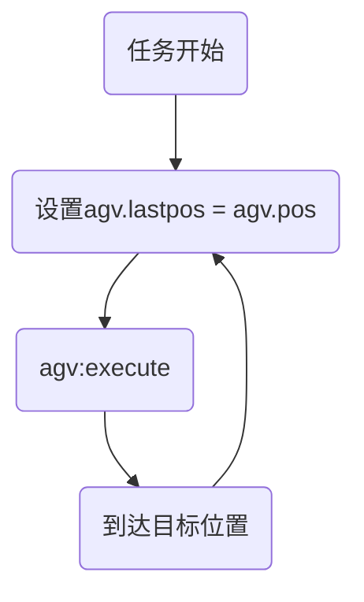
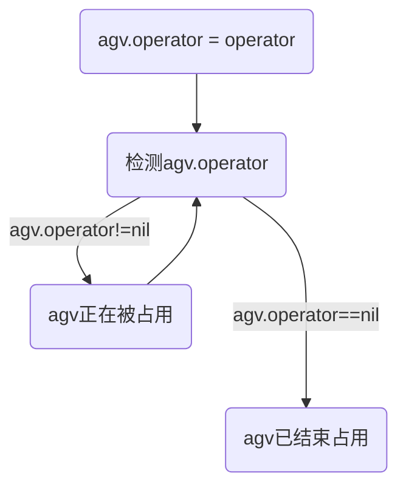

# AGV

AGV 通常用于表示自动导引车辆（Automated Guided Vehicle）

继承: AGV → [Agent](../agent.md)

```lua
local agv = AGV(config)
```

## 属性

对象基本属性

- `agv.type = "agv"` 记录对象类型
- `agv.model` AGV 的三维模型
- `agv.id` AGV 的 id，设置为 AGV 三维模型的 id

AGV 对象中继续添加的属性（创建 AGV 时可通过 config 修改）

- `agv.speed = 10` AGV 的速度
- `agv.roty = 0` 以 y 为轴的旋转弧度，默认方向为 0
- `agv.container = nil` 集装箱三维模型
- `agv.height = 2.10` AGV 平台高度
- `agv.road = nil` AGV 当前绑定的道路对象。相对应 road:registerAgv 中设置 AGV 的 road 属性。
- `agv.lastpos` AGV 的任务初始位置，默认为 `agv.pos`

运行时设置的属性

- `agv.taskType` AGV 执行的任务类型，包括`unload`和`load`
- `agv.targetContainerPos` AGV 目标位置`{bay,row,col}`

## 位置管理

- `agv.pos`：AGV 当前位置
- `agv.lastpos`：AGV 上一次位置/AGV 任务开始时的位置

与位置有关的任务，位置管理流程如下：



## 交互流程

主要指 AGV 如何与 Crane 分别通过 waitoperator 和 waitagent 任务进行交互



## 任务

任务列表

- [move2](#move2) 移动到某个位置
- [waitoperator](#waitoperator) 等待 operator 进行操作
- [moveon](#moveon) 沿着指定道路行驶
- [onnode](#onnode) 经过/到达节点
- [register](#register) 任务过程中向 operator 注册 AGV

### move2

根据 AGV 的移动速度，将 AGV 移动到指定坐标位置(x,y,z)。

```lua
{"move2", {x, y, z, ...}}
```

不同于 Agent 类设置了三个维度的速度，AGV 的速度是标量，因此在移动的时候计算了每个方向的分速度。

### waitoperator

根据输入的 operator 参数，AGV 等待 operator 对其进行操作。

```lua
{"waitoperator", {operator=}}
```

当 AGV 进入 waitoperator 任务时，首先在 init 部分设置 agv.operator = operator，表示 AGV 已经到达并进入等待状态。紧接着立刻通过协程(coroutine.queue(0, ...))唤醒 operator.execute，起到立刻通知作用。如果此时 operator 已经在 waitagent 任务内，则能够在本时刻立刻收到通知，作出反应；如果还在执行其他任务，那么也不会造成其他影响。

当 execute 部分检测到 agv.operator=nil 时，表示 operator 已经完成对 AGV 的占用/操作，此时通过协程(coroutine.queue(0, ...))唤醒 AGV，结束等待状态，结束 waitoperator 任务，继续执行其他任务。

### moveon

沿着给定的道路 road 行驶，distance 为行驶距离。

```lua
{"moveon",{road=,distance=,targetDistance=}}
```

#### 可选参数

- `distance`: 表示 AGV 在道路上的初始距离（从起点开始算），默认为 0
- `targetDistance`: 表示 AGV 结束本任务时在道路上的距离（从起点开始算），默认为道路长度

### onnode

```lua
{"onnode", node, fromRoad, toRoad}
```

任务过程参数列表

- `node` 节点对象
- `fromRoad` 从哪条道路进入
- `toRoad` 进入到哪条道路
- `param.fromRadian` 从 Road1 进入到 Node 的旋转弧度（Road1 方向向量的弧度）
- `param.toRadian` 从 Node 进入到 Road2 的旋转弧度（Road2 方向向量的弧度）
- `param.deltaRadian` 从 Road1 转向 Road2 的旋转弧度。用于判断左转还是右转，如果`deltaRadian > 0`则为左转，反之为右转，如果`deltaRadian = 0`则不需要转弯
- `param.walked` 已经旋转的弧度/已经通过的直线距离
- `param.radius` 转弯半径
- `param.center` 转弯中心(圆心)
- `param.turnOriginRadian` 转弯起始弧度，旋转 90 度方向与转弯方向相反
- `param.angularSpeed` 角速度

#### 可选参数

- `toRoad`: 如果`toRoad`为`nil`，则表示在`node`上停止。

### register

在执行这个任务时令 AGV 向指定的 operator 进行注册（执行`operator:registerAgv()`函数）。

```lua
{"register", {operator=, f=}}
```

register 只有 init 部分，没有 execute 部分

#### 可选参数

- `f`: 一个函数，在执行`operator:registerAgv()`之前执行
