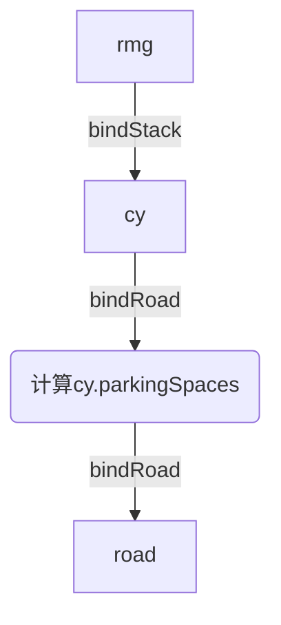
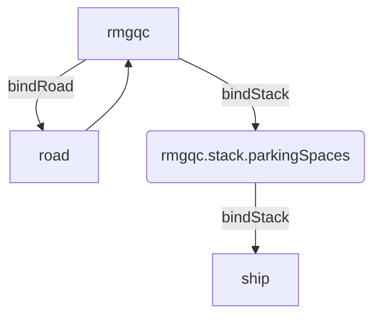

# Crane

Crane 是起重机的抽象基类。由于各种起重机的功能和流程类似，所以将其抽象为一个基类。

继承: Crane → [Agent](../agent.md)

```lua
local crane = Crane(config)
```

## 属性

由于 Crane 继承自 Agent，因此部分属性与 Agent 相同。

- `agentqueue = {}` 等待服务的 Agent 的队列
- `type = "crane"` 对象类型
- `anchorPoint` 起重机的锚点位置
- `pos` 起重机的位置
- `speed = {2, 4, 8}` 各方向速度
- `attached = nil` 起重机当前抓取的集装箱，初始化为 nil
- `lastpos` 上一次位置，详见 Agent

## 对象绑定关系

Crane 与不同类型的 Stack 绑定流程稍有不同，主要是因为各 Crane 和 Stack 之间的依赖关系不同。

### RMG-CY



cy 绑定道路，得到各 bay(col)对应的停车点。
rmg 绑定一个 cy(stack)，存取其中的集装箱。

### RMGQC-Ship



rmgqc 要求先绑定 road，再绑定 stack

- rmgqc 一般在港口有一个固定的位置，此处认为其绑定一条道路。
- rmgqc 可以脱离 Ship 存在，但是 Ship 需要存取集装箱时，必须有一个 rmgqc 为其服务。

## 任务

任务列表

- [move2](#move2) 移动到指定位置
- [attach](#attach) 抓取集装箱
- [detach](#detach) 放置集装箱
- [waitagent](#waitagent) 等待指定 Agent 到达
- [unwaitagent](#unwaitagent) 结束指定 Agent 的 waitoperator 任务

### move2

将 Crane 移动到指定坐标位置。

```lua
{'move2', {x, y, z}}
```

> 注意虽然 move2 任务中使用 setpos() 设置了位置，但是 Crane 类似一个抽象类，没有实现 setpos() 方法，实现放在了子类中。

如果只有集装箱位置，可以使用 getContainerCoord() 函数将 col,height,bay 转换为 x,y,z 坐标。

### attach

抓取指定的集装箱。

```lua
{"attach", {row, col, level}} -- 抓取堆场中指定位置的集装箱
{"attach", nil} -- 抓取agv上的集装箱
```

attach 中的参数是目标位置。如果没有指定位置，则为抓取 agv 上的集装箱；否则抓取堆场中的集装箱。

attach 瞬间完成，因此 execute 只执行一次就直接删除任务。

> 假设：Crane 每次只能同时与一个 agv 进行交互，且同时只能执行一个任务。

### detach

放置集装箱到指定的位置。

```lua
{"detach", {row, col, level}} -- 放置集装箱到堆场中指定位置
{"detach", nil} -- 放置集装箱到agv上
```

detach 中的参数是目标位置。如果没有指定位置，则将集装箱放置到对应 bay 位置的 agv 位置上；否则放置集装箱到堆场中。

detach 瞬间完成，因此 execute 只执行一次就直接删除任务。

### waitagent

等待指定 Agent（AGV）到达。

```lua
{'waitagent', {agent=}}
```

当 Crane 进入 waitagent 任务后，变为被动状态（其他事件发生或被协程重新唤起时才会连带更新本任务状态）。当 execute 部分检测到指定的 Agent 的 operator 为自身时，即表示指定的 Agent 到达，此时 Crane 结束等待状态并删除 waitagent 任务，继续执行其他任务。

可以同时查阅 AGV 的[waitoperator](./agv.md#waitoperator)任务。

### unwaitagent

通过直接修改指定 Agent 的状态结束 Crane 对其的占用状态，使 Agent 结束 waitoperator 任务。

```lua
{'unwaitagent', {index=}}
```

index 为 Agent 在 agentqueue 中的索引。也就是说，可以通过 index 来指定结束哪一个 Agent 的 waitoperator 任务。

unwaitagent 任务相当于发送一个信号，是立刻执行完毕的，其 dt 为 nil，任务的 execute 执行完即删除任务。

任务的 execute 部分会将指定的 Agent 的 operator 置为 nil，结束 Crane 对其的占用，并立刻通过协程唤醒指定 Agent 的 execute() 执行任务，达到通知的目的。如果指定的 Agent 在 Crane 前执行 waitoperator 任务中 execute 的部分，则协程能够使其在当前时刻再次执行 execute 部分并收到通知；否则也只是对于其他任务再次执行一次 execute，而 dt=0 不会有影响。

可以同时查阅 AGV 的[waitoperator](./agv.md#waitoperator)任务。

## 函数

### 工具函数

- [getContainerCoord(bar, row, level)](#getcontainercoord): 获取堆场中(row, bay, level)对应{x,y,z}的位置

> 此处的 Agent 指的是 AGV 或者其他搬运工具

#### getpos

获取 Crane 的位置。返回 anchorPoint 的坐标

```lua
x, y, z = crane:getpos()
```

#### setpos

设置 Crane 的位置。由于 setpos 需要调用三维模型，因此需要在子类中重写实现。

```lua
crane:setpos(x, y, z)
```

由于 Crane 是一个抽象类，不具体实现 setpos 方法。如果子类未重写 setpos 方法直接调用，将触发 Crane 内的 setpos 方法，会引发错误提示终止程序运行。

#### attach

抓取指定位置的集装箱，或抓取 Agent 上的集装箱。

```lua
crane:attach(row, bay, level) -- 抓取stack中指定位置的集装箱
crane:attach() -- 抓取Agent上的集装箱
```

> x, y, z 对应 row, bay, level

Crane 直接操作对应的 Agent，从其中获取集装箱（table）。

#### detach

将集装箱放置到指定位置，或放置到 Agent 上。

```lua
crane:detach(row, bay, level) -- 放置集装箱到stack中指定位置
crane:detach() -- 放置集装箱到Agent上
```

> x, y, z 对应 row, bay, level

Crane 直接操作对应的 Agent，将集装箱放置到其中。

#### bindStack

绑定对应的 Stack 对象，设置对应参数。

```lua
crane:bindStack(stack)
```

#### bindRoad

绑定对应的 Road 对象。

```lua
crane:bindRoad(road)
```

#### registerAgv

注册对应的 AGV 对象。
Crane 将 Agent 作为 AGV 注册。要求输入的 agent 已经设置 agent.taskType 和 agent.targetContainerPos 属性，方便调用函数添加对应的任务序列。

```lua
crane:registerAgv(agv)
```

#### getContainerCoord

```lua
coordTable = rmg:getContainerCoord(row, bay, level)
-- coordTable: {x, y, z}
```

- 当 `row` 为-1 时，获取的坐标为对应 bay 的道路位置。
- 当 `row` 为-1 且 `col` 为 1 时，获取的坐标位置为道路上 AGV 集装箱高度的位置。

### 任务集合函数

任务集合函数将根据将要实现的动作为 Crane 的任务序列添加一组任务。

- lift2TargetPos(row, bay, level): 将集装箱从 agv 抓取到目标位置，默认爪具在移动层。这个函数会标记当前 rmg 任务目标位置。
- lift2Agent(row, bay, level): 将集装箱从目标位置移动到 agv，默认爪具在移动层。这个函数会标记当前 rmg 任务目标位置。
- move2TargetPos(row, bay): 移动到目标位置，默认爪具在移动层。
- move2Agent(bay): 移动到 agv 上方，默认爪具在移动层。

以上的一系列操作都默认爪具在移动层，动作结束后也将爪具恢复到移动层位置。
