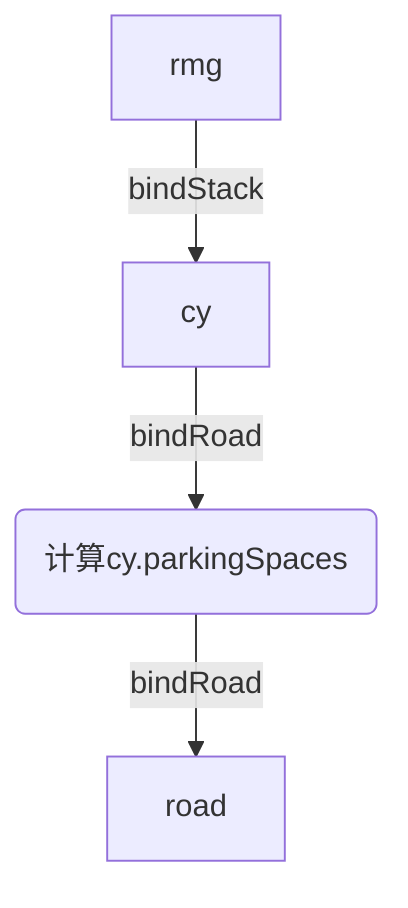
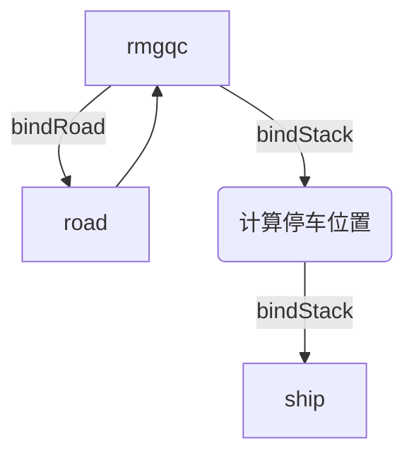

# Crane
## 字段

创建新RMG的时候，需要`cy`和`actionObjs`作为依赖传入。`cy`需要先绑定道路。

- agvqueue: 等待服务的agv队列
- currentAgv: 用于指示当前正在服务的agv对象。阻止其他agv对rmg进行不合时宜的attach或者detach操作，避免扰乱rmg的操作顺序。

## 对象绑定
Crane与不同类型的Stack绑定流程稍有不同

### RMG-CY


cy绑定道路，得到各bay(col)对应的停车点。
rmg绑定一个cy(stack)，存取其中的集装箱。

### RMGQC-Ship

rmgqc要求先绑定road，再绑定stack
- rmgqc一般在港口有一个固定的位置，此处认为其绑定一条道路。
- rmgqc可以脱离Ship存在，但是Ship需要存取集装箱时，必须有一个rmgqc为其服务。

## 任务
### move2
```lua
{'move2', {x, y, z}}
```
移动到指定坐标位置。

如果只有集装箱位置，可以使用 [getContainerCoord()]() 函数进行转换

#### 参数
1:col(x), 2:height(y), 3:bay(z)
[4:初始bay, 5:已移动bay距离,向量\*2(6,7),当前位置\*2(8,9),初始位置\*2(10,11),到达(12,13)\*2]

参数命名：
| 参数编号 | 含义          | 命名        |
| -------- | ------------- | ----------- |
| 4        | 初始bay       | `initalZ`   |
| 5        | 已移动bay距离 | `movedZ`    |
| 6,7      | 向量          | `vectorXY`  |
| 8,9      | 当前位置      | `currentXY` |
| 10,11    | 初始位置      | `initalXY`  |
| 12       | 到达Z         | `arrivedZ`  |
| 13       | 到达X         | `arrivedX`  |

### waitagent
```lua
{'waitagent', {agent=}}
```
等待Agent到达。Agent到达后需要唤醒本Agent继续执行任务

### attach
```lua
{"attach", {row, col, level}} -- 抓取堆场中指定位置的集装箱
{"attach", nil} -- 抓取agv上的集装箱
```
attach中的参数是目标位置。如果没有指定位置，则为抓取agv上的集装箱；否则抓取堆场中的集装箱。
> 假设：rmg每次只能同时与一个agv进行交互，且同时只能执行一个任务。

### detach
```lua
{"detach", {row, col, level}} -- 放置集装箱到堆场中指定位置
{"detach", nil} -- 放置集装箱到agv上
```
detach中的参数是目标位置。如果没有指定位置，则将集装箱放置到对应bay位置的agv位置上；否则放置集装箱到堆场中。

## 函数
- lift2TargetPos(row, bay, level): 将集装箱从agv抓取到目标位置，默认在移动层。这个函数会标记当前rmg任务目标位置
- lift2Agent(row, bay, level): 将集装箱从目标位置移动到agv，默认在移动层。这个函数会标记当前rmg任务目标位置
- move2TargetPos(row, bay): 移动到目标位置，默认在移动层
- move2Agent(bay): 移动到agv上方，默认在移动层
- getContainerCoord(bar, row, level): 获取堆场中(row, bay, level)对应{x,y,z}的位置

> 此处的Agent指的是AGV或者其他搬运工具

### getContainerCoord()
```lua
coordTable = rmg:getContainerCoord(row, bay, level)
-- coordTable: {x, y, z}
```

- 当 `row` 为-1时，获取的坐标为对应bay的道路位置。
- 当 `row` 为-1且 `col` 为1时，获取的坐标位置为道路上AGV集装箱高度的位置。