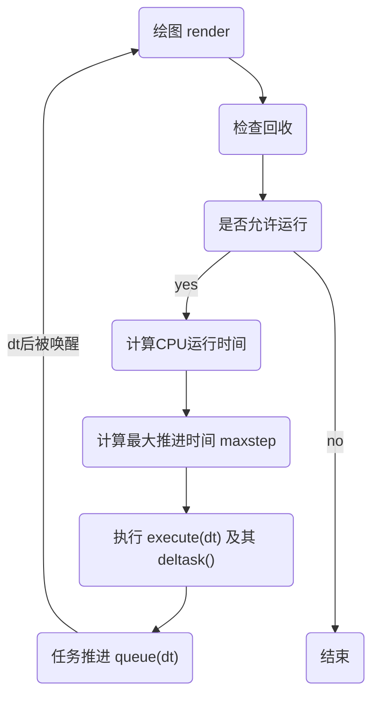

# WatchDog

## 更新流程
`update()` 总体推进

```mermaid
graph
render(绘图 render) --> recycle(检查回收) --> runcommand(是否允许运行)
runcommand -- yes --> refresh_time(计算CPU运行时间) --> maxstep(计算最大推进时间 maxstep) --> execute("执行 execute(dt) 及其 deltask()") --> queue("任务推进 queue(dt)")
queue -->|dt后被唤醒| render
runcommand ----->|no| stop(结束)
%% maxstep -->|dt<0| recycle2(检查回收) --> maxstep
```

1. maxstep对本次推进任务具有影响
2. 如果本任务在maxstep就能确认执行完成（如agv到达事件），需要删除任务，可以直接删除任务然后返回-1，触发任务删除并重新运行。
3. render后再回收可以保证agv在正确的时间被回收。