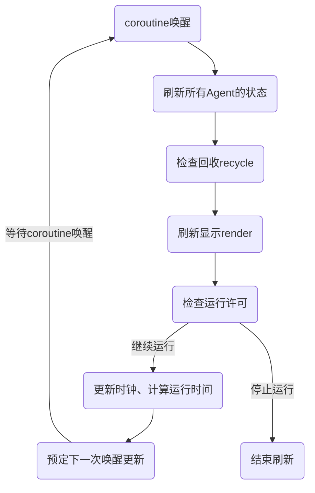

# WatchDog

WatchDog的作用是刷新显示，不会影响仿真进程。

## 工作模式
WatchDog根据CPU运行时间，通过`coroutine.queue()`添加到协程队列中。通过不断递归调用实现定时唤醒刷新。

WatchDog每次唤醒都会执行`agent:execute()`，刷新所有对象的状态，然后刷新显示。

### 现象
**回收延迟**：目前由于不认为回收会对仿真造成影响，因此把回收放在WatchDog中进行。
- 由于WatchDog根据CPU运行时间刷新，而不是在仿真关键时间节点刷新，因此会造成回收延迟。
- 回收时间只代表WatchDog删除Agent的时间，没有其他含义。

## 参数
- `isImmediateStop`: 当所有组件都没有需要执行的任务时停止刷新。如果仿真事件不是紧接着的（如随机生成或导入事件），则建议关闭（设置为`false`）。