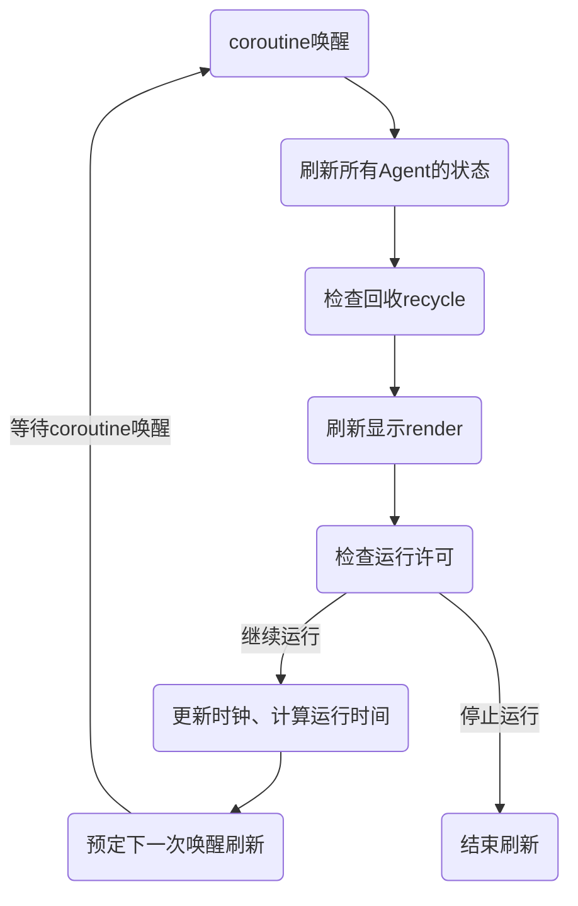

# WatchDog

WatchDog 的作用是刷新显示，不会影响仿真进程。

## 使用

### 创建 WatchDog 实例

```lua
local watchdog = WatchDog(simv, ActionObjs, [{isImmediateStop=}]) -- 创建watchdog的实例
```

参数：

- ActionObjs: 动作对象列表，包含所有动作对象。WatchDog 的实例会在刷新时刻为动作队列中的每个 agent 执行`execute()`函数以执行动作和刷新位置，最后执行`scene.render()`刷新显示。
- simv: 仿真速度
- 可选参数
  - isImmediateStop: 当检测到无动作对象时是否立即停止刷新，默认为 true

### 刷新显示

令 Watchdog 开始刷新场景显示，一般情况下，只用在仿真开始时调用一次即可。

```lua
watchdog.refresh()
```

可以向 refresh 中注入函数，在每次刷新场景之间都执行该函数

```lua
function()
    -- do something
end

watchdog.refresh(f)
```

## 工作模式

WatchDog 根据 CPU 运行时间，通过`coroutine.queue()`添加到协程队列中。通过不断递归调用实现定时唤醒刷新。

WatchDog 每次唤醒都会执行`agent:execute()`，刷新所有对象的状态，然后刷新显示。



### 现象

**回收延迟**：目前由于不认为回收会对仿真造成影响，因此把回收放在 WatchDog 中进行。

- 由于 WatchDog 根据 CPU 运行时间刷新，而不是在仿真关键时间节点刷新，因此会造成回收延迟。
- 回收时间只代表 WatchDog 删除 Agent 的时间，没有其他含义。

如果有特殊需求可以按需修改。

## 运行中主要的变量

- `isImmediateStop`: 当所有组件都没有需要执行的任务时停止刷新。如果仿真事件不是紧接着的（如随机生成或导入事件），则建议关闭（设置为`false`）。
- `lasttime`: 上一次刷新的时间，用于计算刷新间隔。
- `runcommand`: 是否允许继续运行。是从`scene.render()`函数中获得的返回值，检测程序运行状态表侄，以及时停止运行。
- `recycleType`: 需要回收的Agent类型列表，默认为`{'agv'}`。当Agent的类型在列表中且Agent无任务时会被回收。可以通过`config`重新设置列表为空来取消回收